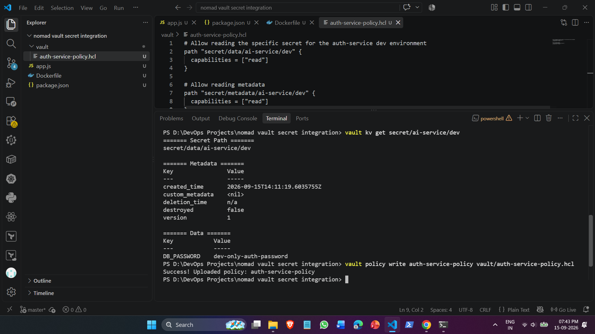
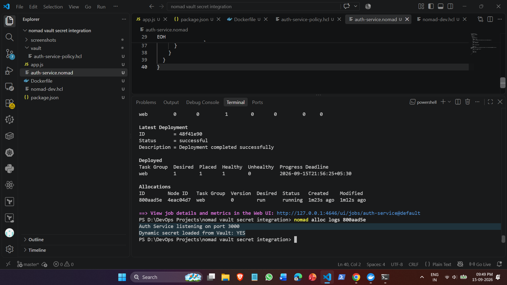
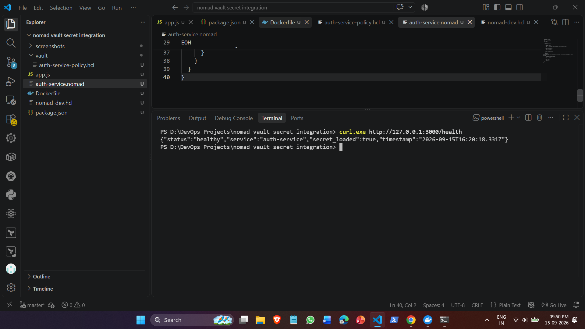
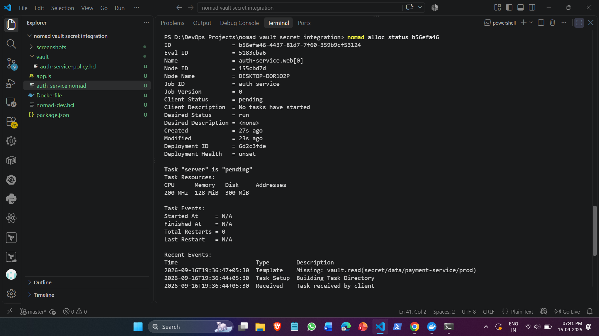

# Nomad & HashiCorp Vault Dynamic Secret Integration (DEV-154)

## Architecture Overview
This project demonstrates dynamic runtime secret injection into a Nomad service using HashiCorp Vault Workload Identity (JWT authentication) and template rendering without hardcoded credentials.

- **Orchestration:** HashiCorp Nomad running locally with the `raw_exec` driver.
- **Secrets Engine:** HashiCorp Vault KV v2 engine (`secret/ai-service/dev`).
- **Workload Identity:** Nomad generates short-lived JWTs tied to task identities, verified against Nomad's JWKS endpoint (`/.well-known/jwks.json`).
- **Least-Privilege Policy:** Task capabilities are strictly bounded to `secret/data/ai-service/dev` via `auth-service-policy`.
- **Dynamic Injection:** Secrets are read by Nomad at task allocation startup and rendered directly into `secrets/app.env` before the application boots.

---

## Project Structure
```text
nomad-vault-secret-integration/
├── app.js                          # Lightweight HTTP service with /health check
├── auth-service.nomad              # Nomad job specification with Vault Workload Identity
├── nomad-dev.hcl                   # Nomad client configuration enabling raw_exec & Vault
├── package.json                    # Node.js project manifest
├── vault/
│   └── auth-service-policy.hcl     # Vault ACL policy enforcing least privilege
└── screenshots/
    ├── 01-vault-secret-and-policy.png
    ├── 02-nomad-vault-job-running.png
    ├── 03-secret-injection-health-check.png
    └── 04-vault-acl-denial.png
```

---

## Configuration Files

### 1. Nomad Agent Configuration (`nomad-dev.hcl`)
```hcl
client {
  enabled = true
  options = {
    "driver.raw_exec.enable" = "1"
  }
}

vault {
  enabled     = true
  address     = "[http://127.0.0.1:8200](http://127.0.0.1:8200)"
  task_token_ttl = "1h"
}
```

### 2. Vault ACL Policy (`vault/auth-service-policy.hcl`)
```hcl
# Allow reading dev secret for auth-service
path "secret/data/ai-service/dev" {
  capabilities = ["read"]
}

# Allow reading metadata
path "secret/metadata/ai-service/dev" {
  capabilities = ["read"]
}
```

### 3. Application Code (`app.js`)
```javascript
const http = require('http');

const PORT = process.env.PORT || 3000;
const DB_PASSWORD = process.env.DB_PASSWORD || 'NOT_FOUND';

const server = http.createServer((req, res) => {
  if (req.url === '/health') {
    res.writeHead(200, { 'Content-Type': 'application/json' });
    res.end(JSON.stringify({
      status: 'healthy',
      service: 'auth-service',
      secret_loaded: DB_PASSWORD !== 'NOT_FOUND',
      timestamp: new Date().toISOString()
    }));
    return;
  }

  res.writeHead(200, { 'Content-Type': 'text/plain' });
  res.end('Auth Service running with Nomad + Vault dynamic secrets.');
});

server.listen(PORT, () => {
  console.log(`Auth Service listening on port ${PORT}`);
  console.log(`Dynamic secret loaded from Vault: ${DB_PASSWORD !== 'NOT_FOUND' ? 'YES' : 'NO'}`);
});
```

### 4. Nomad Job Specification (`auth-service.nomad`)
```hcl
job "auth-service" {
  datacenters = ["dc1"]
  type        = "service"

  group "web" {
    count = 1

    task "server" {
      driver = "raw_exec"

      config {
        command = "node"
        args    = ["D:/DevOps Projects/nomad vault secret integration/app.js"]
      }

      identity {
        name = "vault_default"
        aud  = ["vault.io"]
      }

      vault {
        role = "nomad-workloads"
      }

      template {
        data        = "DB_PASSWORD=\"{{ with secret \\\"secret/data/ai-service/dev\\\" }}{{ .Data.data.DB_PASSWORD }}{{ end }}\"\nPORT=3000\n"
        destination = "secrets/app.env"
        env         = true
      }

      resources {
        cpu    = 200
        memory = 128
      }
    }
  }
}
```

---

## Setup & Deployment Steps

### 1. Vault Authentication & Secrets Engine Setup
```powershell
$env:VAULT_ADDR="[http://127.0.0.1:8200](http://127.0.0.1:8200)"
$env:VAULT_TOKEN="root"

# 1. Enable KV v2 secrets and write credentials
vault kv put secret/ai-service/dev DB_PASSWORD="dev-only-auth-password"

# 2. Upload policy
vault policy write auth-service-policy vault/auth-service-policy.hcl

# 3. Configure JWT Auth for Nomad Workload Identity
vault auth enable -path=jwt-nomad jwt
vault write auth/jwt-nomad/config jwks_url="[http://127.0.0.1:4646/.well-known/jwks.json](http://127.0.0.1:4646/.well-known/jwks.json)"

# 4. Map JWT Role to Nomad workload claims
vault write auth/jwt-nomad/role/nomad-workloads `
    role_type="jwt" `
    bound_audiences="vault.io" `
    user_claim="nomad_job_id" `
    token_policies="auth-service-policy" `
    token_period="1h" `
    token_type="default"
```

### 2. Deploy Job to Nomad
```powershell
nomad job run auth-service.nomad
```

---

## Verification & Proofs

### Step 1: Vault Secret Creation & ACL Policy Upload
Confirmed that the secret `secret/ai-service/dev` was stored and the restricted policy `auth-service-policy` was applied:



### Step 2: Nomad Workload Deployment & Log Output
The Nomad job deployed successfully. Allocation logs show that the workload identity authenticated against Vault and dynamically injected the database password:



### Step 3: Health Endpoint Secret Check
Queried the live `/health` endpoint to ensure the application received the secret in its runtime environment:



### Step 4: Access Control & Least-Privilege Validation (Negative Test)
Attempted to alter the Nomad template to read an unauthorized path (`secret/data/payment-service/prod`). The template engine halted allocation startup with a permission denial error, proving that `auth-service-policy` strictly enforces least-privilege access:

